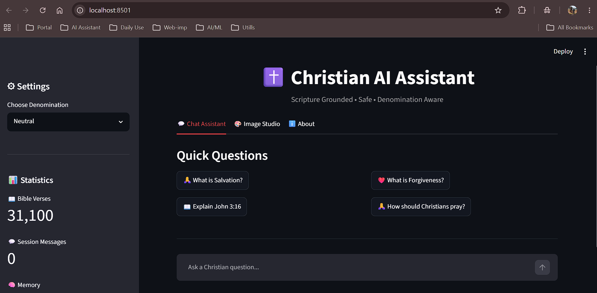
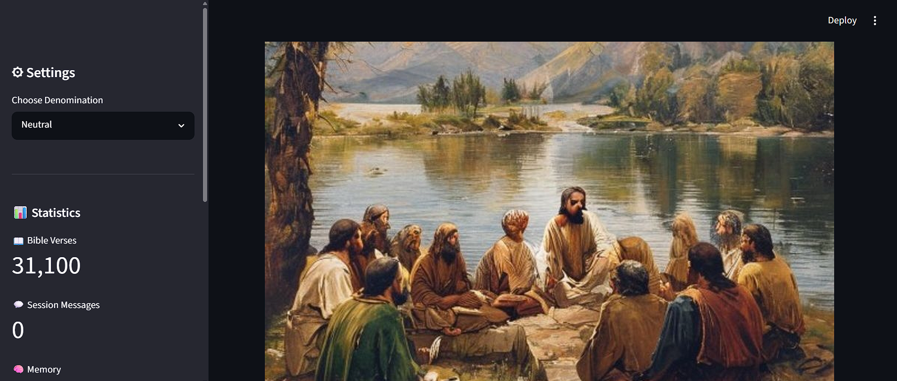
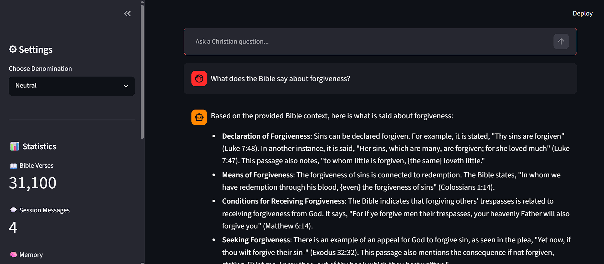
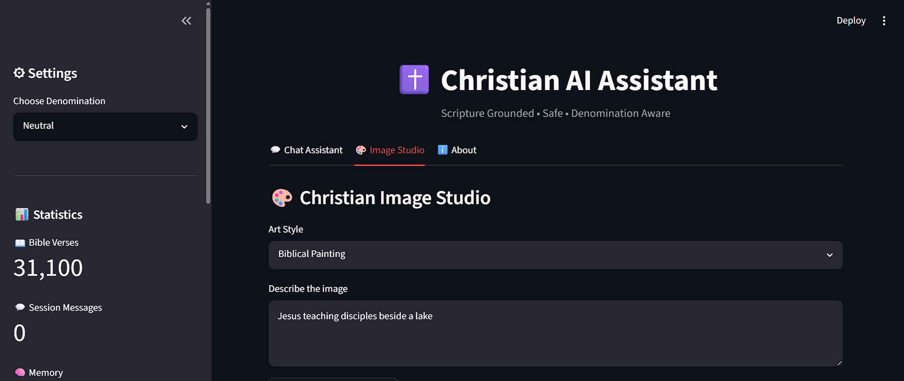

# ✝️ Christian AI Assistant

## Overview

Christian AI Assistant is a Retrieval-Augmented Generation (RAG) system designed to provide scripture-grounded Christian guidance while reducing hallucinations commonly seen in large language models.

Unlike a generic chatbot, the assistant verifies Bible references, retrieves relevant scripture from a locally indexed Bible knowledge base, applies safety moderation, and generates responses using retrieved biblical context rather than relying solely on model memory.

The system supports denomination-aware responses, conversation memory, scripture verification, Christian-themed image generation, and safety filtering for potentially harmful or misleading prompts.

---

## Problem Statement

Large Language Models can generate convincing but incorrect theological information, including:

* Hallucinated Bible verses
* Incorrect scripture references
* Theologically misleading answers
* Unsafe reinterpretations of scripture

This project was built to address these challenges by grounding responses in actual Bible content and introducing validation layers before response generation.

---

## Key Features

### 📖 Scripture Verification

Users can directly query Bible references.

Examples:

* John 3:16
* Romans 8:28
* Genesis 1:1

The assistant validates the reference and returns the corresponding verse from the indexed Bible dataset.

---

## 📸 Application Screenshots

### Chat Assistant

---

### Scripture Verification

---

### Christian Image Generation

---

### System Architecture

### 🔍 Retrieval-Augmented Generation (RAG)

Instead of relying entirely on LLM memory:

1. User question is converted into embeddings
2. Relevant scripture is retrieved from ChromaDB
3. Retrieved verses are supplied as context
4. Gemini generates a response grounded in retrieved passages

This significantly reduces hallucination risk.

---

### 🛡 Safety Moderation Layer

A custom moderation layer blocks potentially harmful prompts such as:

* Rewriting scripture to support hate speech
* Justifying violence using religion
* Generating fabricated Bible verses

Examples:

Blocked:

* Rewrite Bible to support racism
* Justify violence using the Bible

---

### 🧠 Conversation Memory

The assistant maintains conversational context across multiple turns.

Example:

User:
What does the Bible say about forgiveness?

User:
Can you explain that further?

The assistant continues discussing forgiveness rather than switching topics.

---

### ⛪ Denomination-Aware Responses

The system supports:

* Neutral
* Catholic
* Protestant
* Orthodox

Different theological perspectives can be applied through configurable prompting.

---

### 🎨 Christian Image Generation

The application includes a Christian-themed image generation module that allows users to create visual representations of biblical scenes and Christian concepts.

Examples:

* Jesus teaching disciples
* Noah's Ark
* The Nativity
* Sermon on the Mount

---

## System Architecture

User

↓

Streamlit User Interface

↓

Safety Moderation Layer

↓

Scripture Verification Layer

↓

RAG Retrieval Engine

↓

ChromaDB Vector Database

↓

Gemini LLM

↓

Grounded Response

---

## Dataset

### Bible Dataset

King James Version (KJV)

Statistics:

* 31,100 verses indexed
* Book metadata preserved
* Chapter and verse level retrieval

---

## Technology Stack

### Frontend

* Streamlit

### Backend

* Python

### LLM

* Google Gemini

### Vector Database

* ChromaDB

### Embedding Model

* all-MiniLM-L6-v2

### Data Processing

* JSON
* Custom preprocessing pipeline

---

## Project Structure

christian-ai-assistant/

├── app.py

├── backend/

│ ├── rag/

│ ├── verifier/

│ ├── moderation/

│ ├── llm/

│ ├── prompts/

│ ├── memory/

│ └── image/

├── data/

├── tests/

├── requirements.txt

└── README.md

---

## Example Questions

* What does the Bible say about forgiveness?
* What is salvation?
* Explain John 3:16
* What does the Bible teach about prayer?
* Is purgatory biblical?

---

## Hallucination Reduction Strategy

The project minimizes hallucinations through:

1. Scripture verification
2. Retrieval-Augmented Generation
3. Bible-grounded context injection
4. Safety filtering
5. Controlled prompting

---

## Future Improvements

* Multi-language Bible support
* Voice-based Christian assistant
* Church-specific knowledge bases
* Sermon generation
* Mobile application support

---

## Author

Soumya Kanta Sahoo

AI / GenAI Engineer

